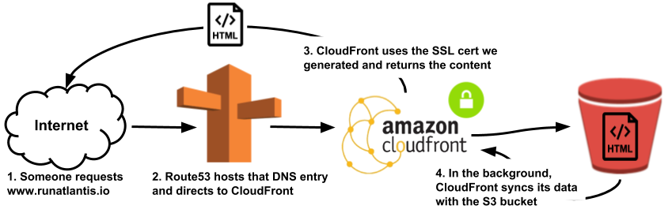

# Terraform provisioned static site hosting on AWS S3.

---
### ACCEPTANCE CTITERIA:
1. You should have an AWS account credentials. 
* Setup IAM access key and secret on your AWS account.
* To login to your account run on your terminal 
```
aws configure
```
2. Download and extract the  latest release of the Terraform. 

* [Download Terraform - Terraform by HashiCorp](https://www.terraform.io/downloads.html)

* Run 
```
unzip terraform
```
```
mv terraform /bin
```
---
  SOLUTION: 
* provider.tf - This section sets up the provider (the plugin for terraform which tells it how to talk with a cloud provider) and the region where the resources will be created. 

* s3.tf - Provides a S3 bucket resource. The bucket index and error documents are configurable as different static sites might need to use these in different ways.There is also added bucket policies as the bucket has to be public.
* acm.tf - service that lets you easily provision, manage, and deploy public and private Secure Sockets Layer/Transport Layer Security (SSL/TLS) certificates for use with AWS services and your internal connected resources.
* cdn.tf - Amazon CloudFront is a fast content delivery network (CDN) service that securely delivers data, videos, applications, and APIs to customers globally with low latency, high transfer speeds, all within a developer-friendly environment. 
* route53.tf - DNS that translates s3 endpoint to your domain
* vars.tf - Input variables serve as parameters for a Terraform, allowing aspects of the code to be customized.

* .gitignore - gitignore file is to allow you to ignore files, such as editor backup files, build products or local configuration overrides that you never want to commit into a repository.
---
  HOW TO USE THIS CODE:

1. Clone this repo
2. add .tvars file
3. Run 
```
terraform init
terraform plan
terraform apply
```
